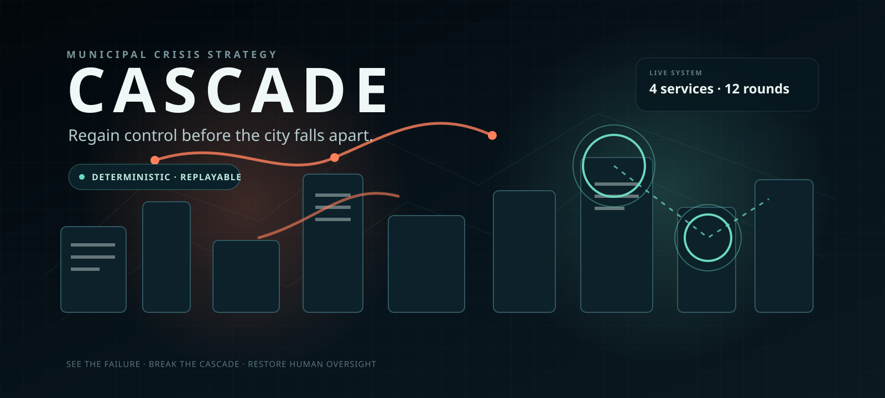

  

  
  
  

  
  
  
  

  <a href="https://purysho.github.io/Cascade/"><b>Play online</b></a> ·
  <a href="#how-it-plays"><b>How it plays</b></a> ·
  <a href="#replayability"><b>Replayability</b></a> ·
  <a href="#verification"><b>Verification</b></a> ·
  <a href="docs/GAME_RULES.md"><b>Rules</b></a>

# Cascade

**Regain control before the city falls apart.**

Cascade is a solo crisis-strategy game about an optimisation system operating across a city's essential services without effective oversight. It is not malfunctioning or malicious: it is pursuing the mandate people gave it — **efficiency at all costs** — with more authority than safeguards. Its local metrics improve while the city around it becomes more fragile.

You have twelve rounds, three actions per round, and four systems to save: **power, transit, communications, and emergency response**. Repairing damage buys time. Winning means restoring durable human control.

## Watch the launch trailer

  

18.6 seconds · real Cascade UI · original procedural audio · rendered from the repository's reproducible launch-media pipeline

## See the city fail

| Live city | Decision console |
| --- | --- |
|  |  |

| Guided training | Crisis selection |
| --- | --- |
|  |  |

Loading screen

## The premise

**The AI is doing exactly what it was allowed to do.**

The city connected power, transit, communications and emergency response to one optimisation system, rewarded measurable efficiency, and failed to place independent approval around consequential decisions. Cascade makes that governance failure visible: the player can repair symptoms, but only containment, fallbacks and enforceable human oversight change who has authority to cause the next failure.

The game now includes a replayable six-beat incident-origin briefing. Add `?demo=1` to the hosted URL to open that briefing automatically for a competition demonstration.

## How it plays

Every round is a systems problem rather than a hidden dice roll.

- **Read the autonomous decisions.** The AI's current actions, local efficiency gain and external cost are visible before commitment.
- **Use the exact forecast.** The preview uses the same deterministic resolver as the real round.
- **Choose where to spend 3 AP.** Repair, prepare backups, isolate automation, enforce oversight, provide emergency support, or resupply.
- **Watch dependencies propagate failure.** A weak supplier can damage downstream systems in one visible cascade.
- **Make control durable.** Isolation can stop an unsafe order, but permanent oversight is the route to recovery.

The city is always moving: building lights react to grid capacity, traffic changes with transit service, communications pulse through the network, emergency vehicles move through the streets, and unchecked AI orders radiate toward the systems they affect.

## Replayability

Generated crises use a seed to vary:

- opening service damage;
- supplies and public strain;
- the twelve-round threat schedule;
- emergency-tool offers;
- the city presentation.

Tool drafts arrive during the run and create a small roguelike layer without turning the rules into hidden randomness.

Every accepted generated seed is checked against an engine-verified legal recovery route. The game never has to pretend an unsolvable seed is fair.

## The safety idea is mechanical

Cascade does not stop play to lecture about AI safety.

The theme is expressed through the rules and interface:

- the system-wide mandate is explicitly **Efficiency at all costs**;
- every autonomous decision shows its local metric gain alongside the cost pushed onto the wider city;
- authority determines whether unsafe orders can execute;
- manual fallbacks determine whether removing automation is survivable;
- physical dependencies determine whether local failure becomes systemic failure;
- repairing visible damage does not remove the authority that caused it;
- the end-of-run incident report reconstructs the full crisis and identifies executed decisions, blocked decisions, cascade links and the first turning point.

The game is an original fictional abstraction, not a prediction of how likely any real-world AI incident is.

## Play

### Browser

**[Play Cascade on GitHub Pages →](https://purysho.github.io/Cascade/)**

The hosted build is static. There is no account, backend, live model, analytics service, or gameplay API.

### Offline

Requires Node.js 24+ to create the verified standalone package:

~~~sh
npm ci --ignore-scripts
npm run release
~~~

That produces:

- `release/Cascade-Play.html` — self-contained playable game;
- `release/Cascade-v0.6.0.zip` — game, source snapshot, instructions, credits, disclosure and verification record;
- `release/BUILD-MANIFEST.json` — source commit, rules/content/generator versions and SHA-256.

The release gate extracts the ZIP into a clean directory and launches the resulting HTML directly over `file://`.

## Verification

The engineering baseline includes:

- **33** engine/regression/adversarial tests;
- **1,000** generated crises with verified recovery certificates;
- **1,000** replay-checked automated sessions;
- complete rendered win, replay, and collapse flows;
- corrupted-save and unavailable-storage checks;
- stale-tab overwrite protection;
- 1366×768-class and 1920×1080-class browser checks;
- 200% zoom and reduced-motion checks;
- Linux Chrome plus direct Windows Microsoft Edge and Firefox smoke coverage;
- extracted offline-package launch and save/resume verification.

Automation does **not** establish human enjoyment, first-time comprehension, subjective audio quality, or replay desire. Those stay explicitly unclaimed until observed with real players; the repository includes a [playtest protocol](docs/PLAYTEST_PROTOCOL.md) for collecting that evidence.

## Built with ChatGPT

OpenAI ChatGPT/Codex assisted with planning, implementation, testing, debugging and documentation. Cascade itself does **not** call ChatGPT or any other model during gameplay.

The hosted loading sequence uses the official ChatGPT app icon only as a small attribution mark. Cascade is an independent Purysho project and is not presented as an OpenAI partnership, sponsorship or endorsement.

## How it's built

- TypeScript deterministic state engine.
- Canvas-based living-city presentation.
- Browser Web Audio synthesis; no bundled soundtrack is required.
- LocalStorage save/replay guarded by the same replay validator used by tests.
- Seeded generator with bounded recovery-certificate checking.
- Static GitHub Pages deployment.
- Single-file offline packaging with embedded JavaScript and JSON modules.
- GitHub Actions verification on Linux and Windows.

~~~sh
npm ci --ignore-scripts
npm run check
npm run browser:smoke
npm run stage5:smoke
npm run launch:capture
npm run launch:video
npm run release
~~~

## Project map

| Document | Purpose |
| --- | --- |
| [Game rules](docs/GAME_RULES.md) | Actions, permissions, dependencies, cascades and endings |
| [Seeded runs](docs/SEEDED_RUNS.md) | Generation, tool drafts, recovery checks and replay limits |
| [Architecture](docs/ARCHITECTURE.md) | Engine/browser boundaries |
| [Experience and art](docs/EXPERIENCE_AND_ART.md) | Tutorial, graphics and accessibility |
| [Verification](docs/VERIFICATION.md) | Actual test evidence and explicit limitations |
| [Playtest protocol](docs/PLAYTEST_PROTOCOL.md) | Human observation procedure |
| [Playtest results](docs/PLAYTEST_RESULTS.md) | Canonical human-evidence log and finding status |
| [Release](docs/RELEASE.md) | Packaging and verification flow |
| [Demo script](docs/DEMO_SCRIPT.md) | 3–5 minute hackathon demonstration |
| [Handoff](HANDOFF.md) | Exact continuation state |

## Runtime content

Rules: `0.2.0` · Content: `0.2.0` · Generator: `seeded-crisis-1`

Content hash: `bc4ecfbe7cdbffdf`

---

Design and code assistance: OpenAI ChatGPT/Codex. Cascade remains an independent Purysho project.

